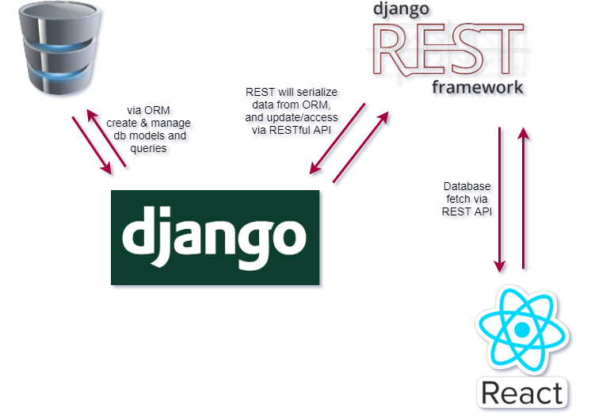

# Blog-BilgiDenizi-(Frontend)

This is my Clarusway Full-stack Developer bootcamp graduation project. It is a _blog site_ project.

-   During this graduation project, I have been use the Agile Methodology.

-   I have been finish the project in a two-week sprint.

-   I have been use Django for the back-end framework to provide REST endpoints.

-   I have been use ReactJS for the front-end library.

-   I have been to publish one repository for the back-end and one for the front-end. I have been to deploy both back-end and front-end parts on Heroku servers using your free tier account.

-   I have been to complete the tasks/tickets in the Jira cloud and follow the project management procedures.

-   I have been to work on the task number/feature branch and push that branch to my Github repositories and make a Pull Request for myself to merge to the main/master branch.

-   Daily stand up meetings have been every day, our group answering these three questions below:
    -   What did you do yesterday?
    -   What will you do today?
    -   What (if anything) is blocking your progress?
